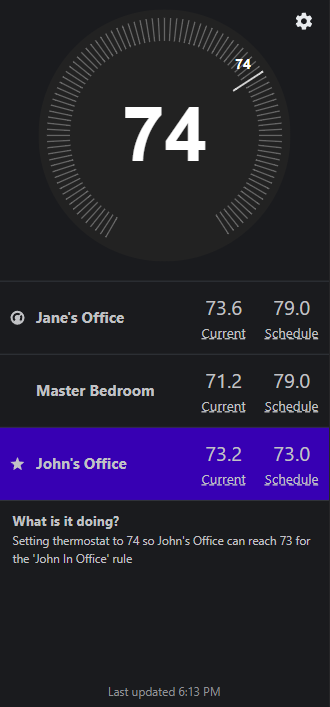

  

# Drey

Multi room thermostat coordination designed for use with [Home Assistant](https://www.home-assistant.io).  

## Why

Normal thermostat software (like Google Nest) doesn't simultaneously consider the temperature in multiple rooms.  While it may be possible to add remote sensors, only one is "active" at any given time, and you cannot precisely control the timing of when they switch.  Drey tries to do better by always considering the temperature of all sensors when deciding what to set the thermostat to.

## Features

 - One thermostat can have multiple sensors (rooms) tied to it
 - Each sensor/room gets its own heating and cooling schedule
 - Drey will make sure the HVAC runs until every room's schedule condition is met
 - Capable of controlling multiple thermostats (with their own sensors) with a single instance of Drey

## Limitations

Because this isn't a physically zoned solution, there are limitations to what Drey can do.  

For example, if the HVAC is in heating mode, Drey will control the thermostat in a way that will ensure that every room is **at least** as warm as its scheduled temperature.  Depending on the ambient conditions in the rooms, that will likely cause one of the rooms to be **warmer** than their scheduled temperature.

The reverse is true for HVAC in cooling mode.  No room's temperature will exceed it's scheduled temperature, but some rooms may be **cooler**.

## Screenshots

